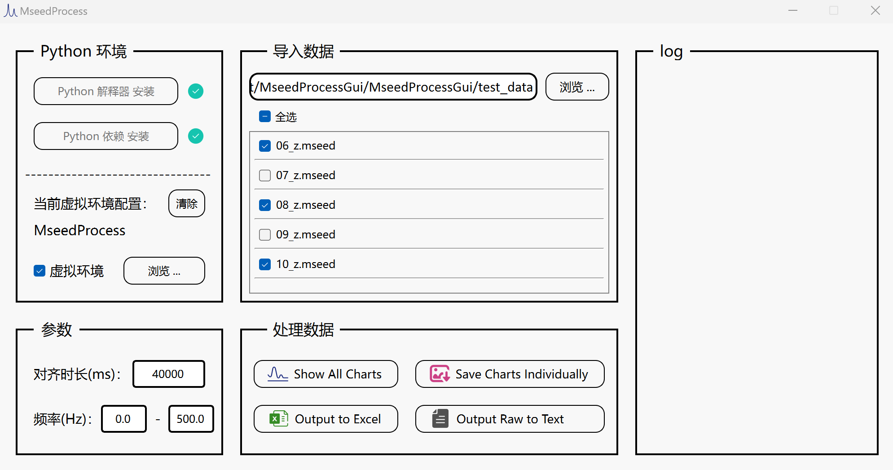

# MseedProcessGui: 地震仪波形数据处理

该程序的功能是对地震仪波形数据（.mseed）进行处理。该程序目前未支持中文路径。

## 使用说明

### 1. Python 环境

1. 程序会自动检查当前计算机的 Python 解释器和所需依赖的安装状态。
2. 如果未安装解释器，点击 “Python 解释器 安装” 按钮，程序会运行默认的安装包，在安装过程中注意勾选 “Add Path”。
3. 如果未安装依赖，点击 “Python 依赖 安装” 按钮，程序会自动安装所需的依赖包（全局环境），等待片刻即可。
4. 根据需要可手动配置 Python 虚拟环境。若已配置虚拟环境，则程序启动时会基于虚拟环境进行检查，并自动使用虚拟环境，即优先使用虚拟环境。（非 Python 开发者可忽略）

### 2. 参数设置

- 数据对齐时长，单位 ms，默认为 40000
- 频域数据输出的频率范围，单位 Hz

### 3. 导入数据

1. 点击右上角的 “浏览” 按钮，选择 “.messd” 文件所在的目录，点击 “选择文件夹” 按钮，则 “浏览” 按钮左侧的文本框中会显示选择的文件目录路径，并且会在下方自动加载此目录下所有 “.mseed” 文件。
2. 可以利用复选框选择需要被处理的 “.mseed” 文件。

### 4. 处理数据

1. 点击 “Show All Charts” 按钮，程序会为所选的所有数据文件生成频谱图并立即显示出来。
2. 点击 “Save Charts Individually” 按钮，程序会为所选的所有数据文件生成频谱图并单独保存在原目录下。
3. 点击 “Output to Excel” 按钮，程序会基于所选的所有数据文件生成一个 Excel 数据表格，会保存频域数据并构建相关图表，表格保存为原目录下的 "result.xlsx"。
3. 点击 “Output Raw to Text” 按钮，程序会为所选的所有数据文件导出原始时域数据到文本文件（.dat）并保存在原目录下。

## 环境

编译环境：MSVC 64-bit

Release 构建环境：QT6
